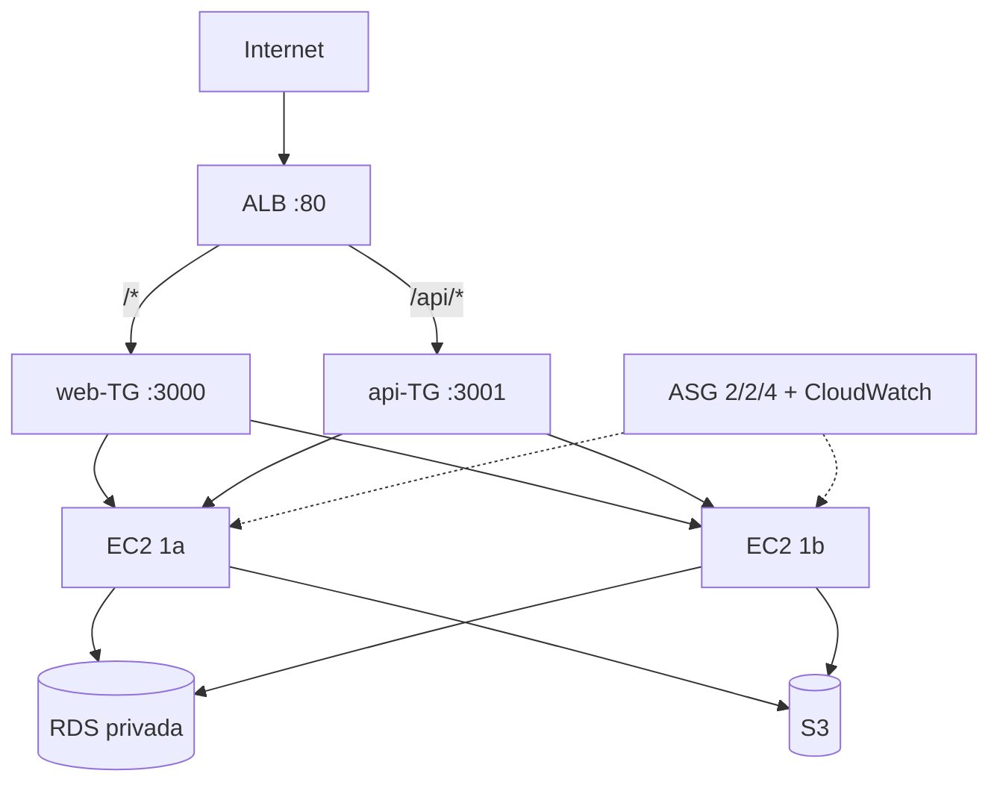

# Arquitectura HW3 — CloudTask escalable y segura

Región: `us-east-1` (AZs `1a` y `1b`). VPC propia `cloudtask-vpc` (`vpc-09adfca2829c8f31c`, `10.0.0.0/16`).

## Diagrama

```
                         Internet
                             |
         +-------------------+-------------------+  subredes PÚBLICAS
         |  10.0.1.0/24 (1a) |  10.0.2.0/24 (1b) |  NACL pública + IGW
         +--------+----------+-------------------+
                  |  ALB cloudtask-alb (:80)
                  |  /* → web-TG(:3000) · /api/* → api-TG(:3001)
         +--------+----------+-------------------+
         |                   |                      subredes PRIVADAS app
         | 10.0.11.0/24 (1a) | 10.0.12.0/24 (1b)    NACL app
      +--v---+            +--v---+
      | EC2  |  ASG 2/2/4 | EC2  |  sin IP pública · rol IAM · SSM
      +--+---+  (escaló ──+--^---+
         |       a 3 real)   |                      subredes PRIVADAS data
         | 10.0.21.0/24 (1a) | 10.0.22.0/24 (1b)    NACL data
         +--------+----------+-------------------+
                  |  RDS PostgreSQL 17 (privada)
   ECR · S3 · CloudWatch (regionales) ← instancias vía NAT GW (1a)
```



## Subredes y red

| Subred | CIDR | AZ | Id | Uso |
|---|---|---|---|---|
| cloudtask-public-1a | 10.0.1.0/24 | 1a | subnet-0e31dc1249f96ad37 | ALB + NAT GW |
| cloudtask-public-1b | 10.0.2.0/24 | 1b | subnet-0da9feb6007d43be7 | ALB (HA) |
| cloudtask-app-1a | 10.0.11.0/24 | 1a | subnet-01fcda1011f08a396 | ASG |
| cloudtask-app-1b | 10.0.12.0/24 | 1b | subnet-0eaf07029e2d15bb9 | ASG |
| cloudtask-data-1a | 10.0.21.0/24 | 1a | subnet-02f72ac687e27ac9f | RDS |
| cloudtask-data-1b | 10.0.22.0/24 | 1b | subnet-06361066432716dd9 | RDS (reserva) |

- `cloudtask-public-rt`: `0.0.0.0/0 → IGW`. `cloudtask-private-rt`: `0.0.0.0/0 → NAT GW` (uno solo en 1a: decisión de costo documentada).
- NACLs stateless: **pública** (in 80/443 + efímeros; out 3000-3001 al VPC + 443 + efímeros), **app** (in 3000-3001 solo desde subredes públicas + efímeros; out 80/443 + 5432 a data + efímeros), **data** (in 5432 solo desde app; out efímeros al VPC).

## Cómputo y balanceo

| Recurso | Detalle |
|---|---|
| ALB | `cloudtask-alb` → `cloudtask-alb-1207092219.us-east-1.elb.amazonaws.com` (internet-facing, subredes públicas) |
| Reglas | `/api/*` → `cloudtask-api-tg` (:3001, health `GET /api/`); por defecto → `cloudtask-web-tg` (:3000, health `GET /`) |
| Launch template | `cloudtask-lt` (AL2023, `t3.micro`, sin IP pública, perfil `cloudtask-ec2-profile`; user-data instala Docker y arranca ambos contenedores) |
| ASG | `cloudtask-asg`: mín 2 / deseado 2 / máx 4 en subredes app, health-check ELB (gracia 300 s) |
| Datos/archivos | RDS `cloudtask-db` (endpoint `cloudtask-db.cc5s2oq48v8f.us-east-1.rds.amazonaws.com`, privada) + S3 `cloudtask-images-340514595007` + ECR `cloudtask-api/web` |

## Seguridad (SGs + IAM)

- `cloudtask-alb-sg`: 80 desde `0.0.0.0/0`.
- `cloudtask-app-sg`: 3000/3001 **solo** desde `cloudtask-alb-sg`. Sin SSH: administración por **SSM Session Manager**.
- `cloudtask-data-sg`: 5432 **solo** desde `cloudtask-app-sg`.
- Rol `cloudtask-ec2-role`: S3 acotado al bucket + `AmazonEC2ContainerRegistryReadOnly` + `AmazonSSMManagedInstanceCore`. Sin claves estáticas.

## Monitoreo y escalado (CloudWatch)

| Alarma | Métrica | Umbral | Acción |
|---|---|---|---|
| `cloudtask-cpu-high` | CPU media ASG | > 70 % en 2×5 min | `cpu-scale-out` (+1, cooldown 300 s) |
| `cloudtask-cpu-low` | CPU media ASG | < 30 % en 3×5 min | `cpu-scale-in` (−1, cooldown 300 s) |
| `cloudtask-alb-5xx` | `HTTPCode_Target_5XX_Count` | > 10 en 5 min | aviso (estado) |
| `cloudtask-unhealthy-hosts` | `UnHealthyHostCount` (web-TG) | ≥ 1 | aviso (estado) |

## Decisiones y Marco de Buena Arquitectura

- **Confiabilidad:** 2 AZs en todos los niveles con tráfico (ALB + ASG + subredes data); health-checks ELB con reemplazo automático (probado: reemplazo InService en ~2 min).
- **Seguridad:** defensa en capas (NACL stateless + SG stateful + subredes privadas + IAM mínimo + SSM sin SSH). Ver § Modelo de responsabilidad compartida en `deployment-hw3.md`.
- **Eficiencia/rendimiento:** un solo ALB con ruteo por path (mitad de costo que dos), escalado horizontal real (2→3 verificado bajo carga).
- **Costos:** un solo NAT GW (tradeoff: si cae 1a, las instancias 1b pierden salida — aceptado para el curso; en producción, un NAT por AZ), instancias `t3.micro` del free tier, despliegue efímero de un día (≈ $1–2).
- **Excelencia operativa:** imágenes inmutables en ECR, user-data reproducible, esquema aplicado al arrancar, evidencia de escalado y self-healing registrada.
