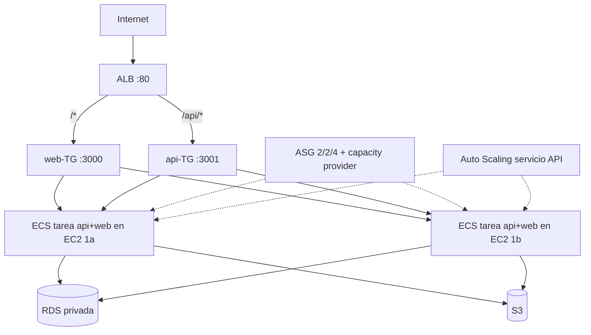

# Arquitectura HW4 — CloudTask en ECS (infraestructura como código)

Todo el stack se crea con **una sola plantilla CloudFormation**: `infra/cloudformation.yaml`
(~100 recursos, stack `cloudtask-hw4`, región `us-east-1`, AZs `1a` y `1b`).
VPC propia `10.0.0.0/16`.

## Diagrama

```
                         Internet
                             |
         +-------------------+-------------------+  subredes PÚBLICAS
         |  10.0.1.0/24 (1a) |  10.0.2.0/24 (1b) |  NACL pública + IGW
         +--------+----------+-------------------+
                  |  ALB cloudtask-alb (:80)
                  |  /* → web-TG(:3000) · /api/* → api-TG(:3001)
         +--------+----------+-------------------+
         |                   |                      subredes PRIVADAS app
         | 10.0.11.0/24 (1a) | 10.0.12.0/24 (1b)    NACL app
      +--v---+  ECS cluster  +--v---+
      | EC2  |  cloudtask-   | EC2  |  t3.micro, AMI ECS-optimizada,
      | (api |  cluster      | (api |  sin IP pública, rol IAM + SSM
      | +web)|  ASG 2/2/4    | +web)|  (capacity provider cloudtask-cap)
      +--+---+               +--+---+
         |                      |           subredes PRIVADAS data
         | 10.0.21.0/24 (1a)    | 10.0.22.0/24 (1b)  NACL data
         +--------+-------------+----------------+
                  |  RDS PostgreSQL 17 (privada, cifrada)
   ECR (imágenes) · S3 (imágenes tasks/) · CloudWatch (regionales)
   Instancias → ECR/S3/CloudWatch vía NAT GW (1a)
```



## Servicios y roles

| Servicio | Recurso (lógico CFN) | Rol |
|---|---|---|
| VPC/red | `VPC`, 6 subredes, `IGW`, 2 RT, `NatGW`+EIP | Aislamiento en 3 tiers × 2 AZs |
| NACLs | `PublicNACL/AppNACL/DataNACL` + 22 entradas | Filtrado stateless por capa (incl. puertos dinámicos ECS 32768-65535 y DNS UDP) |
| SGs | `AlbSG` (80 mundo), `AppSG` (3000-3001 + dinámicos solo ALB), `DataSG` (5432 solo app) | Mínimo privilegio stateful |
| ELB | `ALB`, `WebTG`/`ApiTG`, listener 80 + regla `/api/*` | Punto de entrada único y reparto |
| ECS | `ECSCluster` (Container Insights), `CapacityProvider`+ASG 2/2/4, `ApiService`/`WebService` (2 tareas c/u, spread AZ, puerto dinámico) | Contenedores en EC2: cubre EC2 **y** ECS a la vez |
| ECR | `ApiRepo`/`WebRepo` (scan on push) | Imágenes inmutables `:latest` |
| RDS | `Database` (PG 17.11, `db.t3.micro`, 20 GB gp2 **cifrado**, privada) + `DbSubnetGroup` | Persistencia relacional |
| S3 | `ImageBucket` + política (lectura pública solo `tasks/*`) | Imágenes de usuario |
| IAM | `EcsInstanceRole` (ECS + SSM + S3 acotado), `TaskExecutionRole` (pull/log), `ApiTaskRole` (S3 tarea) | Sin claves estáticas en ningún nivel |
| Monitoreo | CloudWatch Logs (`/ecs/cloudtask-api|web`), 3 alarmas, target tracking | Observabilidad y escalado |

## Escalado y monitoreo

| Recurso | Configuración |
|---|---|
| `ApiCpuTracking` | Target tracking: CPU media del servicio API = 70 % (scale-out 60 s, scale-in 300 s); tareas 2–6; el capacity provider suma EC2 solo |
| `CapacityProvider` | Managed scaling (objetivo 100 %), ASG 2–4 |
| `ApiCpuHighAlarm` | CPU servicio API > 80 % en 2×5 min (aviso) |
| `Alb5xxAlarm` | 5xx del ALB > 10 en 5 min (aviso) |
| `UnhealthyHostsAlarm` | hosts no sanos ≥ 1 en web-TG (aviso) |

## Decisiones (Buena Arquitectura)

- **ECS con EC2 en vez de Fargate/Beanstalk:** un solo modelo cubre "instancias EC2" y "contenedores ECS";
  las tareas son stateless (estado en RDS/S3) y reemplazables.
- **Una plantilla CloudFormation:** despliegue repetible de ~100 recursos con un comando; deriva de los
  pasos CLI probados en HW2/HW3 (la evidencia de que la automatización funciona es este entorno).
- **Puertos dinámicos ECS** (`HostPort: 0` + `HealthCheckPort: traffic-port`): varias tareas por instancia
  sin colisiones; SG/NACL abiertos a 32768-65535 solo desde el ALB.
- **SSM en vez de SSH:** instancias sin IP pública ni puerto 22; gestión con Session Manager/Run Command
  (verificado con comando en ambas instancias).
- **Un NAT GW y RDS Single-AZ sin snapshots:** tradeoffs de costo documentados para un despliegue efímero;
  en producción: NAT por AZ, Multi-AZ y retención de backups.
