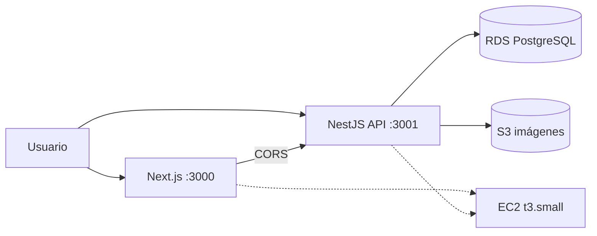

# Arquitectura de la solución — CloudTask

Aplicación de gestión de tareas (Node.js) desplegada en AWS: frontend Next.js + API NestJS en contenedores Docker sobre EC2, PostgreSQL en RDS y almacenamiento de imágenes en S3.

## Diagrama

```
                          +-------------------+
                          |  Usuario (browser)|
                          +--------+----------+
                                   |
                    +--------------+---------------+
                    |                              |
         http://34.231.188.151:3000    http://34.231.188.151:3001/api
                    |                              |
         +----------v-----------+     +------------v------------+
         |  Frontend Next.js    |     |  API NestJS             |
         |  (Docker, p. 3000)   |---->|  (Docker, p. 3001)      |
         |                      | CORS|  validación, CRUD, S3   |
         +----------+-----------+     +---+---------------+---+
                    |                     |               |
                    |      +--------------v--+  +---------v---------+
                    |      | RDS PostgreSQL  |  | S3                |
                    |      | db.t3.micro 17  |  | imágenes `tasks/` |
                    |      | solo acceso EC2 |  | lectura pública   |
                    |      +-----------------+  +-------------------+
                    +------------------------------------------------+
                       EC2 t3.small · VPC por defecto · us-east-1
                       Rol IAM: S3 (solo bucket) + lectura ECR
```

Versión Mermaid (se renderiza en GitHub):



## Componentes

| Capa | Servicio AWS | Recurso | Rol |
|---|---|---|---|
| Cómputo | EC2 | `cloudtask-app` (`t3.small`, Amazon Linux 2023, EIP `34.231.188.151`) | Aloja API + web en Docker |
| Imágenes/contenedores | ECR | `cloudtask-api`, `cloudtask-web` (`:latest`) | Registro de imágenes |
| Base de datos | RDS | `cloudtask-db` (PostgreSQL 17.11, `db.t3.micro`, 20 GB gp2, no pública) | Persistencia de tareas |
| Almacenamiento | S3 | `cloudtask-images-340514595007` (objetos en `tasks/`, lectura pública) | Imágenes subidas por usuarios |
| Red/seguridad | VPC + SG + IAM | `cloudtask-ec2-sg`, `cloudtask-rds-sg`, rol `cloudtask-ec2-role` | Aislamiento y permisos mínimos |

### Reglas de seguridad

- `cloudtask-ec2-sg`: 3000 y 3001 abiertos al mundo (demo), 22 solo desde la IP del administrador. Salida total.
- `cloudtask-rds-sg`: 5432 **solo** desde `cloudtask-ec2-sg`. La base no tiene IP pública.
- Rol IAM `cloudtask-ec2-role` (perfil `cloudtask-ec2-profile`): `PutObject/GetObject/DeleteObject` solo en `tasks/*` del bucket + `ListBucket`, y `AmazonEC2ContainerRegistryReadOnly`. La API no usa claves estáticas: el SDK resuelve las credenciales del rol automáticamente.

## Decisiones técnicas y justificación

1. **RDS PostgreSQL en lugar de DynamoDB.** La app usa Prisma ORM con modelo relacional (`Task` + enums de estado/prioridad); RDS encaja sin reescribir la capa de datos y cumple el requisito (MySQL o PostgreSQL).
2. **EC2 con Docker en lugar de Beanstalk/App Runner.** Control total con CLI (exigencia del flujo del equipo), imágenes reproducibles vía ECR y costo mínimo: una sola instancia aloja API + web.
3. **`t3.small` en lugar de `t3.micro`.** El micro se quedó sin créditos de CPU (throttling que dejó la instancia inaccesible); el small da margen por ~$15/mes cubiertos con créditos.
4. **S3 con URLs públicas** para las imágenes: el servicio genera `https://<bucket>.s3.<region>.amazonaws.com/<key>` y el frontend las muestra con `` directo, sin pasar por la API.
5. **Esquema con `prisma db push` al arrancar** (entrypoint del contenedor): despliegue idempotente sin migraciones manuales; válido para un trabajo académico.
6. **Frontend y API separados con CORS restringido** (`FRONTEND_URL`): respeta la consigna de "aplicación web dinámica respaldada por API + base de datos".
